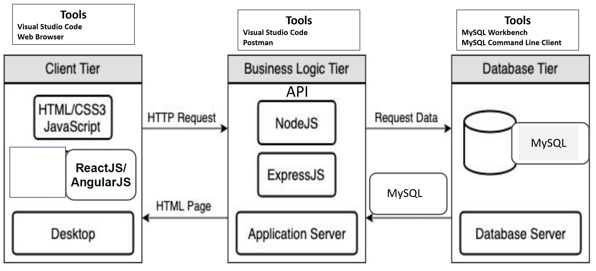

# NUS-MoneyApp
Payment App for campus student at NUS

This Project is done as part of [NUS FinTech SG Programme](https://fintechlab.nus.edu.sg/fintechsg-programme-company/) where student learned about full stack developement concepts , DevOps and product design through a structured 2 months intensive full time course.

This repo is mean as a showcase for what the student has learned to build a payment app from backend database deisgn, API design and deploying the backend server  API to front end serve client. It also include market research and front end UI design for building the mobile payment app as part of the product developement cycle.

##Architecture and Techology stack

