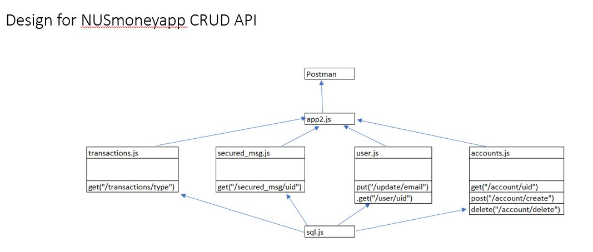
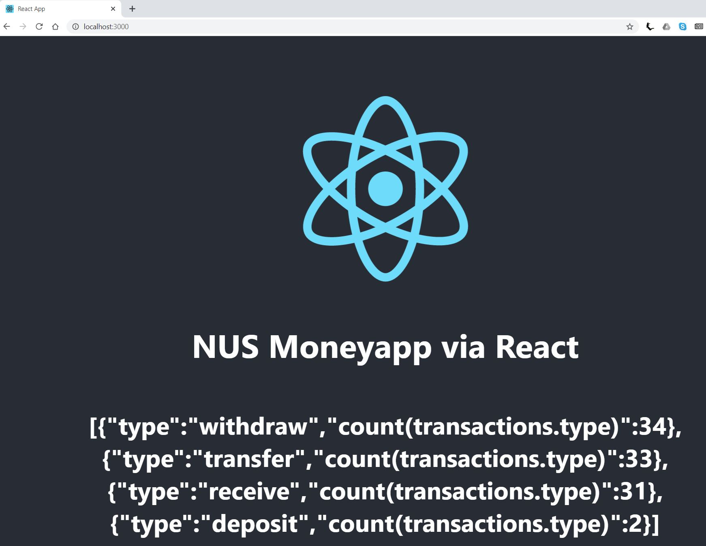

# NUS-MoneyApp
Payment App for campus student at NUS

This Project is done as part of [NUS FinTech SG Programme](https://fintechlab.nus.edu.sg/fintechsg-programme-company/) where students learned about full stack developement concepts , DevOps and product design through a structured 2 months intensive full time course.

This repo is mean as a showcase for what the student has learned to build a payment app from backend database deisgn, API design and deploying the backend server  API to front end serve client. It also include market research and front end UI design for building the final mobile payment app for further development. 

## Architecture and Techology stack

## Backend Database Set up
### Prerequisites
#### Language
MySQL
#### Setup 
1, Install MySQL [Windows OS](https://www.youtube.com/watch?v=WuBcTJnIuzo)

2,Connecting to MySQL client [guide](screenshot/connectSql.JPG)

### Database Schema Design

### Set Up Database

1, Generate test data from [Mockroo.](https://www.mockaroo.com/)

2, Generate SQL script to insert test data. [ (NUSmoney.sql)](Database/NUSmoney.sql)

3, Test the Database with test script from MySQL Workbench or MySQL Command Line Client. [ (testscript.sql)](Database/testscript.sql)

4, Document the outcome in [Database.pptx.](Database/Database.pptx)

## Developing API to Access Database
### Prerequisites
#### Language
Node.JS 

Express.JS

MySQL
#### Setup 
1, Install Visual Studio Code [Here](https://code.visualstudio.com/download)

2, Install Node.JS Package [Here](https://nodejs.org/en/download/)

3, Install Express-generator package [Here](https://www.npmjs.com/package/express-generator)

4, Install Postman [Here](https://www.postman.com/downloads/)

5, Guide to start new Node Project, run express generator , run MySQL and run express body-parser in Visual Studio Code.  [guide](screenshot/guide.JPG)

### API Design

### API documentation

[APIs, listing URIs, method, request and response parameters, and API description.](API/API.pdf)

### API source code

All the .JS [ source code ](API/) listed in the API design diagram

### Test API using Postman

Document the test results in [TestAPI.pptx.](API/TestAPI.pptx)

## Connecting API to Browser Client using React

### Prerequisites
#### Language
Node.JS 

Express.JS

MySQL
#### Setup 

1, Install Create-React-app package [Here](https://www.npmjs.com/package/create-react-app)

2,All the .JS and HTML [ source code ](React/fullstack/) for React backend and frontend server

3, Guide to create React Project and Run React in local host.  [guide](React/React.pdf)

#### Sample Output of calling API using React from browser

